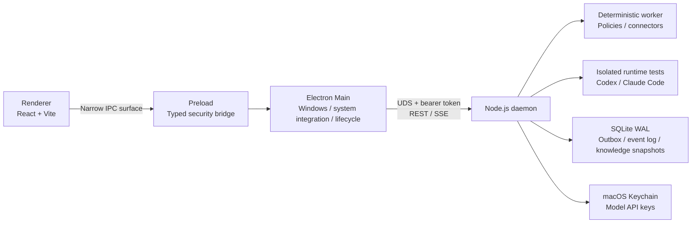

# LuckyTag 2.0

> A local-first personal copilot for macOS.

LuckyTag 2.0 is a local-first personal copilot for macOS. This public build preserves the desktop, daemon, storage, retrieval, and runtime architecture while replacing selected organization-specific connectors with deterministic offline mocks. No public mock performs external messaging, remote-library synchronization, private-network discovery, or work-tracking operations.

Electron provides the control plane. A standalone Node.js daemon owns long-running jobs, connectors, local state, and the execution boundary for agent runtimes. Closing the desktop window does not stop the daemon.

> **Project status: Public architecture preview / v2.0.0.** For security reasons, selected integration code is hidden. If you are interested in the complete project architecture, contact the author at [yxlphobe@gmail.com](mailto:yxlphobe@gmail.com).

## Architecture Overview


> The diagram describes LuckyTag 2.0's **public architecture boundaries and evolution path**. The repository uses React, Vite, custom CSS, a Node.js daemon, a macOS Unix domain socket, and REST/SSE. Connector nodes in the public build are local fixtures backed by synthetic data and invalid example domains; they are not instructions for accessing any external service.



## Current Capabilities

### Local Service and Desktop Control Plane

- A macOS desktop console built with Electron 43, React 19, and Vite 7. The renderer has no access to Node.js capabilities.
- A standalone Node.js daemon runs as a per-user LaunchAgent and can fall back to a detached sidecar under explicitly documented constraints.
- Electron and the daemon communicate exclusively through a `0600` Unix domain socket. Every REST/SSE request requires an installation-scoped bearer token.
- The health handshake includes both the protocol version and the daemon bundle's SHA-256 digest, preventing an upgrade from silently reusing an incompatible process.

### Knowledge and Automated Replies

- Local folder ingestion for Markdown, MDX, TXT, and HTML; the sample-library path is an offline fixture with synthetic documents.
- BM25-like lexical retrieval that combines Chinese character bigrams with English terms and returns traceable excerpts and sources.
- A local sample-message fixture demonstrates typed boundaries and deterministic receipts without contacting an external messaging system.
- An immutable `channelId` allowlist, first-run watermarking, source-message retraction and human-takeover checks, and hourly rate limiting.
- Dry-run mode by default. Low-confidence evidence, non-text messages, unknown send outcomes, or changes to any safety gate cause the workflow to fail closed.
- A `pending / sending / sent / ignored / needs_manual / recalled` state machine with local audit records.

Phase 1 never writes chat content or automated replies back into the knowledge base, preventing generated output from contaminating the evidence used for subsequent answers.

### Agent Runtime Configuration

- **Application Configuration** can detect Codex CLI and Claude Code runtimes.
- Users can keep the runtime's default authentication or configure a BYOK model name, provider endpoint, and API key.
- Custom Codex models use the OpenAI Responses protocol; custom Claude Code models use the Anthropic Messages protocol.
- The current implementation provides runtime detection, credential management, and **one-shot, isolated model connectivity tests**. Agents do not participate in the Phase 1 retrieval, decision, or sending pipeline.
- Every test uses a separate `0700` working directory, a restricted environment, `shell: false`, bounded output, a timeout, and process-group cleanup.

### Connectors and Supporting Workspaces

- SampleAuth: a generic identity boundary retained independently from the redacted connector examples.
- DemoWorkflow Requirements: an offline sample that produces editable synthetic drafts and invalid example links.
- Sample Device: a fail-closed UI placeholder; hardware capabilities are not enabled.

## Implementation Status

| Capability | v0.3 status | Notes |
| --- | --- | --- |
| Electron renderer / preload / main-process separation | Implemented | React, Vite, and custom CSS; `contextIsolation` and the renderer sandbox are enabled |
| Standalone local service | Implemented | Node.js, macOS UDS, REST/SSE, and a per-user LaunchAgent |
| Deterministic knowledge-grounded automated replies | Implemented | Allowlisted polling, lexical retrieval, policy gates, an outbox, and auditing |
| Local data layer | Implemented | SQLite WAL, JSON documents, an outbox, and an append-only event table |
| Codex / Claude Code integration | Partially implemented | Runtime detection, Keychain-backed BYOK credentials, and one-shot model connectivity tests; not connected to the reply pipeline |
| Sample connectors / SampleAuth / DemoWorkflow | Mock only | Selected integrations are replaced by deterministic local fixtures in this public build |
| SampleDevice | Roadmap | The current version neither detects nor connects to the hardware |
| Vector database | Roadmap | The current version uses an in-process lexical index and persists knowledge snapshots in SQLite |
| General-purpose agent / session / workflow engine | Roadmap | The current scheduler serves only the deterministic DEMO_MESSAGE polling job |
| Skills / MCP / plugin platform | Roadmap | Model connectivity tests explicitly disable tools, MCP, hooks, and session persistence |
| Web / mobile / cloud control plane | Roadmap | The current version provides only a local Electron control plane |

## How Automated Replies Work

1. The daemon validates the master switch, dry-run setting, exact group allowlist, knowledge snapshot, and connector state.
2. The first scan records only a group watermark and does not process existing message history.
3. Subsequent polls read new text messages that mention the current user in allowlisted groups, excluding the user's own messages, retracted messages, and messages already processed.
4. The local lexical index retrieves evidence. If the score does not meet the threshold, the message is marked for manual handling; no model is asked to invent an answer.
5. The worker deterministically assembles a candidate reply from up to three matching excerpts and writes it to the outbox before attempting delivery.
6. Immediately before sending, the worker revalidates the source message, latest group history, knowledge snapshot, policy version, allowlist, and human-takeover state.
7. A dry run creates only a preview record. Live sending requires native confirmation and uses a stable UUID to limit duplicate delivery.
8. An uncertain send outcome enters a bounded retry path or `needs_manual`; LuckyTag never retries indefinitely without confirmation.

See [docs/architecture.md](./docs/architecture.md) for the full state machine, data model, and trust boundaries.

## Requirements

### Building and Development

- macOS; the current packaging script targets Apple silicon
- Node.js `>=22.12.0`; Node.js 24 LTS is recommended
- pnpm `10.28.2`, as declared by the repository's `packageManager` field

### Optional Runtimes

- Codex CLI
- The official Claude Code npm package; the current trusted baseline is `@anthropic-ai/claude-code@2.1.112`

Before passing a BYOK API key to a runtime, LuckyTag verifies the trusted entry point's canonical path, owner, permissions, and SHA-256 digest. A runtime upgrade must update both the trust baseline and its end-to-end tests. Merely placing an executable with the same name on `PATH` does not give it access to the model API key. See the [Claude Code integration guide](./docs/claude-code.md) and [BYOK provider design](./docs/byok-provider-design.md) for details.

### Public Mock Connectors

LuckyTag 2.0 **does not require or invoke external connector CLIs** for the redacted features. The public adapters default to local mock mode and return synthetic data without network access.

Each mock adapter preserves a typed process boundary so readers can study dependency injection, failure handling, and UI state without seeing organization-specific commands, domains, credentials, or authorization material. The Apache-2.0 license grants no access to external systems.

| CLI | Current purpose | Tested baseline |
| --- | --- | --- |
| `sample-message-mock` | Empty event pages and deterministic local receipts | Built in |
| `sample-library-mock` | Synthetic document metadata and local-only content | Built in |
| `sample-auth-mock` | Synthetic local identity state | Built in |
| `sample-workflow-mock` | Synthetic drafts and invalid example URLs | Built in |

No external connector installation or authorization is needed for the public mock paths:

```bash
# Install the repository dependencies.
pnpm install
# Run the local desktop development build.
pnpm dev
# Verify the public safety boundary.
pnpm security:scan
# Run type and unit checks.
pnpm typecheck && pnpm test
```

The example connector names are repository-local fixtures and intentionally do not map to distributable third-party executables.

## Local Development

```bash
pnpm install
pnpm dev
```

Run the standard quality checks with:

```bash
pnpm security:scan
pnpm security:audit
pnpm typecheck
pnpm test
pnpm build
```

Tests that exercise the actual Electron renderer or trusted runtime CLIs require explicit environment flags and are not included in the default suite. Runtime/BYOK tests connect only to a loopback mock provider and use placeholder API keys; they must not read real model credentials or make external requests:

```bash
pnpm test:metric-layout:e2e
pnpm test:byok:e2e
pnpm test:codex:runtime:e2e
pnpm test:claude:e2e
```

Never put a real API key in a test, shell history, screenshot, or repository file. Prefer macOS Keychain or an environment variable visible only to the current process.

## Packaging

```bash
pnpm package:mac
```

The output is written to `release/mac-arm64/LuckyTag 2.0.app`. The current command creates an Apple silicon `.app` directory build for local validation, applies an ad hoc signature, and does not produce a DMG. It has not undergone Developer ID signing or notarization. Post-package verification checks Electron Fuses, App Transport Security, the Node.js sidecar, UDS authentication, and file permissions.

A production distribution requires a trusted Developer ID, Hardened Runtime entitlements, notarization, and a verifiable update chain. Do not bypass organizational policy by disabling the Electron sandbox or Gatekeeper.

## Safe First Run

1. Start the application and confirm every public connector is identified as a local mock or unavailable fixture.
2. Add and synchronize one narrowly scoped knowledge source. Confirm that retrieval can match the [sample knowledge document](./examples/knowledge/known-test.md) or another known document.
3. Add a synthetic channel identifier to the allowlist to explore the offline UI and state transitions:

   ```bash
   pnpm dev
   ```

4. Keep dry-run mode enabled, run one cycle, and inspect the candidate reply, citations, and state transitions.
5. Simulate low-confidence evidence, human takeover, and a retracted source message. Confirm that none results in a send.
6. Confirm that enabling the demo switch still produces only local mock receipts.

## Local Data and Credentials

The default data directory is:

```text
~/Library/Application Support/luckytag/
```

- SQLite stores configuration, knowledge mirrors, reply bodies, the outbox, and event summaries. This data is not encrypted at the application layer by default.
- The daemon communication token is stored in a `0600` file. It is a capability boundary for processes under the same macOS user, not a defense against a compromised user session or root.
- Persisted model API keys are written only to macOS Keychain and scoped by runtime and normalized provider endpoint. When a user saves or replaces a key, the plaintext briefly passes through request memory along the renderer → preload → main process → daemon path. It is never written to SQLite, logs, or command-line arguments; subsequent snapshots expose only an `apiKeyConfigured` boolean.
- Public sample connectors hold no credentials and perform no external synchronization, live sends, or remote work-tracking actions.
- Local-first does not mean every optional runtime is offline: explicit model connectivity tests may contact only the endpoint a user deliberately configures.

Protect local data with FileVault, a controlled user account, and current system patches. Never attach the data directory or unsanitized diagnostic logs directly to a public issue.

## Exploring the Public Demo Workflow

The **DemoWorkflow Requirements** workspace is an offline architecture sample. It uses synthetic records to demonstrate validation, preview, confirmation, and result rendering without invoking an external command or creating a real record.

The sample project may be specified by name, a fixture ID beginning with `P`, or a `workflow.example.invalid` URL. A cycle may use a fixture ID beginning with `C`. These values are deliberately non-production and exist only to exercise typed UI states.

## Project Structure

```text
src/daemon/        Node.js daemon, REST/SSE, Keychain, and agent-runtime boundaries
src/main/          Electron main process, daemon client, windows, and system integration
src/main/core/     Domain services, worker, retrieval, and SQLite storage executed by the daemon
src/preload/       Narrow, strongly typed IPC bridge
src/renderer/      React desktop console and custom CSS
src/shared/        Cross-process contracts and input validation
tests/             Unit, integration, security regression, and opt-in end-to-end tests
scripts/           Packaging hardening and artifact verification
docs/              Architecture, integration boundaries, testing, and design documents
examples/          Sanitized configuration and knowledge samples
```

## Further Reading

- [v0.3 architecture and trust boundaries](./docs/architecture.md)
- [SampleAuth and sample-device boundaries](./docs/sampleauth-and-sample-device.md)
- [Claude Code integration](./docs/claude-code.md)
- [BYOK provider design](./docs/byok-provider-design.md)
- [Testing and release gates](./docs/testing.md)
- [Contributing guide](./CONTRIBUTING.md)
- [Security policy](./SECURITY.md)
- [Changelog](./CHANGELOG.md)

## Known Limitations

- Public connector paths are deterministic fixtures rather than server-side webhooks or an enterprise event service.
- SampleAuth represents only synthetic local identity state; it does not imply that DEMO_MESSAGE or SampleLibrary is connected.
- Knowledge retrieval does not yet use a vector database or enforce fine-grained group-to-source ACLs.
- Agent configuration tests and automated replies are independent pipelines. Enabling an agent does not change reply content.
- Per-run directories and process cleanup do not constitute a macOS container, virtual machine, or complete least-privilege sandbox.
- A per-user LaunchAgent remains available only while that user has an active macOS login session. The detached fallback does not provide launchd crash recovery or login-time startup guarantees.
- SQLite transactions, the outbox, and restart recovery reduce crash and duplicate-delivery risks; they are not a backup, cross-site recovery mechanism, or strict exactly-once guarantee for external systems.
- SQLite triggers restrict updates and deletion of `event_log`, but the table is not cryptographically signed or tamper-proof.
- The default workflow handles text only. Images, attachments, voice messages, and actions requiring broader permissions are escalated for manual handling.
- Public sample receipts are deterministic local fixtures; they provide no delivery guarantee for any external platform.

## Contributing and License

Read the [contributing guide](./CONTRIBUTING.md) before submitting a change. Report security issues through the [private vulnerability reporting process](./SECURITY.md).

LuckyTag 2.0 source code is licensed under the [Apache License 2.0](./LICENSE). The public mock names and invalid example domains do not identify or grant access to any external product or service.
