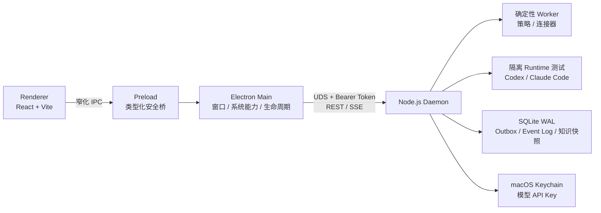

# LuckyTag

> Local-first personal copilot for macOS.

LuckyTag 是一个面向 macOS 的本地优先个人分身助理。v0.3 的可用闭环聚焦于**可审计的钉钉知识库自动回复**：同步用户明确授权的本地或语雀资料，在本机建立确定性的词法索引，只轮询显式白名单群，并在 dry-run、证据阈值、撤回检查、人工接管检查和限流全部通过后预演或受控发送。

Electron 是控制面；独立 Node.js Daemon 持有长期任务、连接器、本地状态和 Agent Runtime 的执行边界。关闭桌面窗口不会主动停止 Daemon。

> **项目状态：Preview / v0.3.0。** 当前实现面向个人授权、本机运行和安全验证，不是企业级机器人事件服务，也没有提供正式签名、公证和自动更新的发布渠道。

## 架构总览


> 上图描述 LuckyTag 的**目标边界与演进路线**，同时包含已实现组件和未来能力。v0.3 当前使用 React + Vite + 项目自有 CSS、Node.js Daemon、macOS Unix Domain Socket 和 REST/SSE；尚未实现图中的 Ant Design/Tailwind、Bun、Named Pipe/WebSocket、独立向量数据库、通用 Agent/Session/Workflow、Skills/MCP/插件平台，以及 Web/移动端入口。下文与 [架构文档](./docs/architecture.md) 以当前源码行为为准。



## 当前能力

### 本机服务与桌面控制面

- Electron 43 + React 19 + Vite 7 的 macOS 桌面控制台，Renderer 不拥有 Node.js 权限。
- 独立 Node.js Daemon 通过用户级 LaunchAgent 运行；在明确的权限限制下可降级为 detached sidecar。
- Electron 与 Daemon 仅通过 `0600` Unix Domain Socket 通信，每次 REST/SSE 请求都需要安装级 Bearer Token。
- 协议版本和 Daemon bundle SHA-256 参与健康握手，升级时不会静默复用不兼容的旧进程。

### 知识与自动回复

- 本地 Markdown、MDX、TXT、HTML 文件夹镜像；语雀单文档和知识库通过本机 CLI 镜像。
- 中文双字元与英文词项结合的 BM25-like 词法检索，返回可追溯片段和来源。
- DWS CLI 登录态探测、`@` 我的消息轮询、群历史回查，以及带 UUID 的幂等发送。
- 不可变 `openConversationId` 白名单、首次启用只建立水位、撤回与人工接管检查、小时级限流。
- 默认 dry-run；低证据命中、非文本消息、未知发送结果和安全门变化都会 fail closed。
- `pending / sending / sent / ignored / needs_manual / recalled` 状态机与本地审计记录。

一期不会把聊天内容或机器人回复自动写回知识库，避免输出反向污染证据。

### Agent Runtime 配置

- “应用配置”支持探测 Codex CLI 与 Claude Code Runtime。
- 可配置 Runtime 默认认证，或 BYOK 的模型名、Provider URL 和 API Key。
- Codex 自定义模型使用 OpenAI Responses 协议；Claude Code 自定义模型使用 Anthropic Messages 协议。
- 当前仅实现 Runtime 探测、凭据管理和**单次隔离的模型连通测试**；Agent 不参与一期自动回复的检索、决策或发送链。
- 每次测试使用独立 `0700` 工作目录、收敛环境、`shell: false`、有界输出、超时和进程组回收。

### 连接器与辅助工作台

- OpenAuth：统一身份状态、登录、刷新和安全退出。它不会自动授权 DWS 或语雀。
- Dima 需求：读取指定群聊时间窗，确定性生成可编辑草稿，用户确认后才创建工作项。
- 钉钉 A1：仅保留 fail-closed 接口与 UI 占位，尚未启用硬件能力。

## 实现状态

| 能力 | v0.3 状态 | 说明 |
| --- | --- | --- |
| Electron Renderer / Preload / Main 分层 | 已实现 | React + Vite + 项目 CSS；`contextIsolation` 与 Renderer sandbox 已启用 |
| 独立本机服务 | 已实现 | Node.js、macOS UDS、REST/SSE、用户级 LaunchAgent |
| 确定性知识库自动回复 | 已实现 | 白名单轮询、词法检索、策略链、Outbox 和审计 |
| 本地数据层 | 已实现 | SQLite WAL、JSON 文档、Outbox、append-only 事件表 |
| Codex / Claude Code 集成 | 部分实现 | Runtime 探测、Keychain BYOK 和单次模型连通测试；未接入回复链 |
| DWS / 语雀 / OpenAuth / Dima | 条件可用 | 依赖未随项目分发的对应 CLI、授权和网络环境 |
| 钉钉 A1 | 路线图 | 当前不探测、不连接硬件 |
| 向量数据库 | 路线图 | 当前为进程内词法索引，知识快照持久化于 SQLite |
| 通用 Agent / Session / Workflow | 路线图 | 当前调度器只服务确定性的 DWS 轮询任务 |
| Skills / MCP / 插件平台 | 路线图 | 当前模型测试会显式关闭工具、MCP 与 hooks |
| Web / 移动端 / 云端控制面 | 路线图 | 当前仅支持本机 Electron 控制面 |

## 自动回复如何工作

1. Daemon 检查总开关、dry-run、精确群白名单、知识快照和连接状态。
2. 首次扫描只记录群水位，不处理已有历史消息。
3. 后续轮询读取白名单群中 `@` 当前用户的新增文本消息，并排除本人消息、撤回消息和已处理消息。
4. 本机词法索引检索证据；未达到阈值时记录为人工处理，不调用模型补写答案。
5. Worker 从最多三段命中证据确定性组成候选回复，并先写入 Outbox。
6. 发送前重新检查原消息、最新群历史、知识快照、策略版本、白名单和人工接管状态。
7. dry-run 只留下预演记录；真实发送需要原生确认，并使用稳定 UUID 限制重复投递。
8. 发送结果不确定时进入受限重试或 `needs_manual`，不会无限盲重试。

详细状态机、数据模型和信任边界见 [docs/architecture.md](./docs/architecture.md)。

## 环境要求

### 构建与开发

- macOS；当前打包脚本以 Apple Silicon 为目标
- Node.js `>=22.12.0`，推荐 Node 24 LTS
- pnpm `10.28.2`（仓库 `packageManager` 声明版本）

### 可选 Runtime

- Codex CLI
- Claude Code 官方 npm 包；当前受信基线为 `@anthropic-ai/claude-code@2.1.112`

LuckyTag 在将 BYOK Key 交给 Runtime 前，会校验受信入口的规范路径、所有者、权限和 SHA-256。升级 Runtime 时需要同步更新受信基线与端到端测试；仅在 `PATH` 中放置同名可执行文件不会取得模型 Key。具体边界见 [Claude Code 集成说明](./docs/claude-code.md) 和 [BYOK 模型接入方案](./docs/byok-provider-design.md)。

### 企业内部连接器（按功能可选）

这些 CLI **不会被 LuckyTag 打包或自动安装**；缺少 CLI、授权或所需网络时，相关卡片会保持不可用，不影响本地 UI 启动。
相关适配器只是对用户本机 CLI 的进程边界，不包含服务端实现、组织凭据或授权材料。使用者必须自行确认其所在组织允许安装、使用和二次分发相应连接器；Apache-2.0 许可证不授予任何第三方系统、商标或内部服务的访问权。

| CLI | 当前用途 | 已验证基线 |
| --- | --- | --- |
| `dws` | 钉钉状态、群聊读取与发送 | `>=1.0.34` |
| `yuque` | 语雀身份与知识镜像 | `>=1.0.19` |
| `openauth` | 统一身份登录与状态 | `@alipay/openauth@1.38.0` |
| `dima` | 需求预览与确认创建 | `>=0.27.63` |

按组织标准安装并完成授权后，可用以下只读命令检查环境：

```bash
dws --version
dws auth status --format json
yuque --version
yuque whoami --json
openauth --version
openauth status --json
dima --version
claude --version
```

不要全局安装会注册同名 `yuque` 可执行文件的其他包，否则可能覆盖当前适配器依赖的 CLI。

## 本地开发

```bash
pnpm install
pnpm dev
```

常用质量检查：

```bash
pnpm security:scan
pnpm security:audit
pnpm typecheck
pnpm test
pnpm build
```

真实 Electron 或受信 Runtime 的端到端测试需要显式环境开关，不会包含在默认测试中。Runtime/BYOK 测试连接本机假 Provider 并使用假 Key，不应读取真实模型凭据或产生外部调用：

```bash
pnpm test:metric-layout:e2e
pnpm test:byok:e2e
pnpm test:codex:runtime:e2e
pnpm test:claude:e2e
```

不要把真实 Key 写入测试、shell 历史、截图或仓库文件；优先从 Keychain 或仅对当前进程可见的环境注入。

## 打包

```bash
pnpm package:mac
```

产物位于 `release/mac-arm64/LuckyTag.app`。当前命令生成用于本机验证的 Apple Silicon `.app` 目录包并采用 ad-hoc 签名，不生成 DMG，也没有完成 Developer ID 签名或公证。打包后校验会检查 Electron Fuses、App Transport Security、Node sidecar、UDS 鉴权和文件权限。

正式分发需要受信 Developer ID、Hardened Runtime entitlements、公证和可验证的更新链；不要通过关闭 Electron sandbox 或 Gatekeeper 来绕过组织策略。

## 安全首跑

1. 完成所需连接器的能力探测；授权会由对应 CLI 自己管理。
2. 添加一个小范围知识源并同步，确认可以命中 [测试知识文档](./examples/knowledge/known-test.md) 或另一篇已知文档。
3. 使用只读命令获取测试群的不可变会话 ID，再显式加入白名单：

   ```bash
   dws chat search --query "测试群名称" --format json
   ```

4. 保持 dry-run，运行一次并检查候选回复、引用和状态变化。
5. 模拟低置信度、人工已接管和源消息撤回，确认均不会发送。
6. 只在单群、小流量验证完成后，显式开启真实发送。

## 本地数据与凭据

默认数据目录：

```text
~/Library/Application Support/luckytag/
```

- SQLite 中保存配置、知识镜像、回复正文、Outbox 和事件摘要；这些数据默认没有应用层加密。
- Daemon 通信 Token 使用 `0600` 文件保存；它是同一 macOS 用户下的 capability，不是对已攻陷用户会话或 root 的防御。
- 模型 API Key 的持久化副本只写入 macOS Keychain，并按 Runtime 与规范化 Provider URL 隔离。用户保存或替换 Key 时，明文会在 Renderer → Preload → Main → Daemon 的请求内存中短暂传递；它不会写入 SQLite、日志或命令行参数，后续快照只返回 `apiKeyConfigured` 布尔值。
- DWS、语雀、OpenAuth 和 Dima 的登录凭据归对应 CLI 管理，LuckyTag 不读取浏览器 Cookie，也不把这些 token 暴露给 Renderer。
- “本地优先”不等于“完全离线”：连接器同步、真实发送、登录与显式模型连通测试都会访问相应服务。

建议配合 FileVault、受控用户账户和系统补丁保护本机数据。不要把数据目录或诊断日志直接提交到 Issue。

## 从群聊创建 Dima 需求

“Dima需求”工作台读取用户指定的群和 `24h / 3d / 7d` 时间窗，以确定性规则生成可编辑草稿。只有用户点击“确认并创建 Dima 需求”后才调用 Dima CLI 写入工作项。

目标空间支持名称、`W` 开头的空间 ID 或 `project.alipay.com` 链接；迭代支持名称、`S` 开头的迭代 ID 或链接。模板与目标空间不一致、群名不唯一、权限不足或未识别出明确诉求时会停止，不猜测目标，也不静默扩大权限。

## 项目结构

```text
src/daemon/        Node.js Daemon、REST/SSE、Keychain 与 Agent Runtime 边界
src/main/          Electron Main、Daemon 客户端、窗口和系统能力
src/main/core/     当前由 Daemon 执行的领域服务、Worker、检索与 SQLite 存储
src/preload/       窄化、强类型的 IPC bridge
src/renderer/      React 桌面控制台与项目 CSS
src/shared/        进程间共享契约与输入校验
tests/             单元、集成、安全回归与显式真实 E2E 测试
scripts/           打包加固和产物验证
docs/              架构、接入边界、测试与设计文档
examples/          脱敏配置和测试知识样例
```

## 延伸阅读

- [v0.3 架构与信任边界](./docs/architecture.md)
- [OpenAuth 与钉钉 A1 接入边界](./docs/openauth-and-a1.md)
- [Claude Code 集成说明](./docs/claude-code.md)
- [BYOK Provider 设计](./docs/byok-provider-design.md)
- [测试与发布门禁](./docs/testing.md)
- [贡献指南](./CONTRIBUTING.md)
- [安全政策](./SECURITY.md)

## 已知限制

- 当前是个人授权 CLI 方案，不是服务端 webhook / 企业机器人事件方案。
- OpenAuth 只表示 IAM 统一身份，不代表 DWS 或语雀已经连接。
- 当前知识检索没有向量数据库，也没有群到知识源的细粒度 ACL。
- Agent 配置测试与自动回复是两条独立链路；启用 Agent 不会改变自动回复内容。
- Runtime 的独立目录和进程回收不是 macOS 容器、虚拟机或完整的最小权限沙箱。
- 用户级 LaunchAgent 只在该用户已登录的 macOS 会话中提供持续运行能力；detached fallback 没有 launchd 的崩溃拉起和登录自启保证。
- SQLite 事务、Outbox 与重启恢复用于降低崩溃和重复投递风险，不等同于备份、异地恢复或外部系统的严格 exactly-once 交付。
- `event_log` 由 SQLite trigger 限制更新和删除，但不是加密签名或防篡改日志。
- 默认只处理文本；图片、附件、语音和需要扩大权限的操作会转人工。
- DWS 的 `--uuid` 幂等窗口为 24 小时；发送结果不确定时 LuckyTag 会停止或受限重试，而不是无限重放。

## 参与贡献与许可证

提交变更前请阅读 [贡献指南](./CONTRIBUTING.md)；安全问题请通过 [私密安全报告流程](./SECURITY.md) 披露。

LuckyTag 源码采用 [Apache License 2.0](./LICENSE) 许可。仓库中提及的第三方产品、CLI、服务和商标归各自权利人所有，其许可证与访问条件不因本项目开源而改变。
