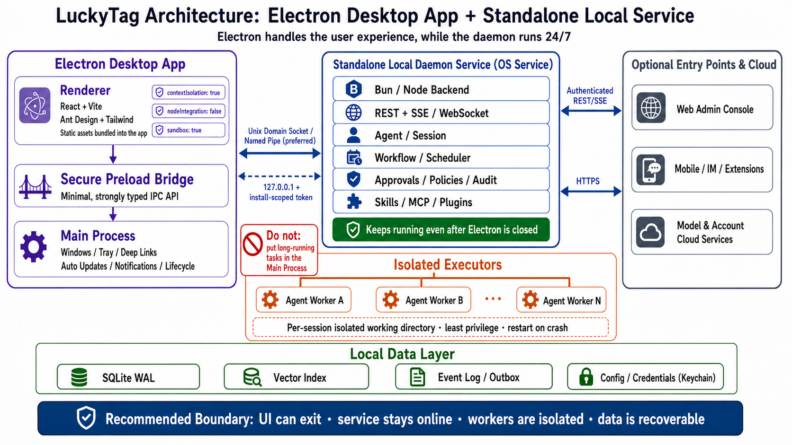
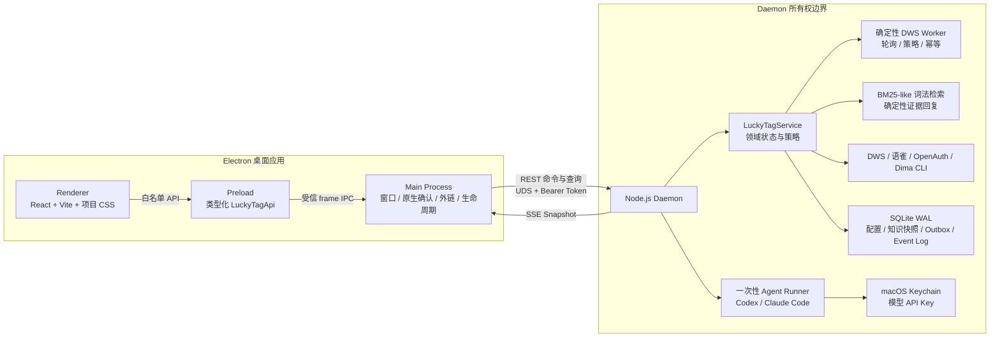
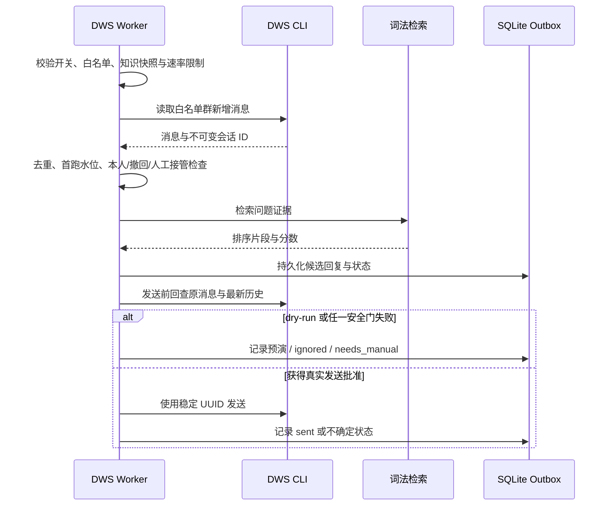

# LuckyTag v0.3 架构与信任边界

本文记录 LuckyTag v0.3 的**当前实现**、安全假设和演进边界。若目标架构图、产品描述与源码行为不一致，以本文的“当前实现”及对应代码为准。

## 目标架构图的阅读方式



附件图表达长期希望维持的边界：UI 可以退出、本机服务可持续运行、外部 Runtime 进程与主应用隔离、本地状态具备事务恢复能力。它不是 v0.3 全部能力的 as-built 图。

| 图中能力 | v0.3 实际状态 |
| --- | --- |
| React + Vite | 已实现；UI 使用项目自有 CSS，没有使用 Ant Design 或 Tailwind |
| Electron 安全边界 | 已实现 `contextIsolation`、禁用 Node integration、Renderer sandbox 和窄化 IPC |
| Bun / Node Backend | 仅实现 Node.js Daemon，没有 Bun Runtime |
| Unix Domain Socket / Named Pipe | 仅实现 macOS Unix Domain Socket，没有 Windows Named Pipe 或 TCP fallback |
| REST + SSE / WebSocket | 实现 REST + SSE，没有 WebSocket |
| Agent / Session、Workflow / Scheduler | 只实现 DWS 轮询调度和单次 Runtime 配置测试，没有通用 Agent/Session/Workflow 引擎 |
| Skills / MCP / Plugins | 未实现；当前模型测试反而会显式关闭工具、MCP、hooks 和会话持久化 |
| Isolated Executors | 实现每次测试独立目录和子进程回收，不是 OS 容器、虚拟机或常驻 Worker 池 |
| SQLite WAL、Event Log / Outbox | 已实现 |
| Vector Index | 未实现；当前为从 SQLite 知识快照恢复的进程内 BM25-like 词法索引 |
| Config / Credentials (Keychain) | 普通配置在 SQLite；只有模型 API Key 持久化到 Keychain |
| Web / Mobile / Cloud entry points | 未实现 |

## v0.3 当前架构



虽然部分领域代码仍位于 `src/main/core/`，它们在 v0.3 由 Daemon 构造并执行，不再由 Electron Main 持有 Worker 定时器。

## 进程职责

| 边界 | 当前职责 | 明确不负责 |
| --- | --- | --- |
| Renderer | 展示快照、收集表单、发起用户动作 | 直接文件系统、子进程、Keychain、网络访问 |
| Preload | 把有限的 `LuckyTagApi` 映射为 IPC 调用 | 暴露 Node/Electron 通用能力 |
| Electron Main | 窗口、可信来源校验、系统文件夹选择器、原生确认、Finder/外链、Daemon 生命周期连接 | 业务 Worker、长期调度、数据库所有权 |
| Node.js Daemon | API、SSE 快照、领域服务、调度、连接器、SQLite、Runtime 启动 | UI 渲染、云端控制面 |
| Runtime 子进程 | 执行一次受约束的模型连通测试 | 自动回复决策、常驻 Agent 会话、任意工具调用 |

## Electron 安全边界

### Renderer 与 Preload

- `nodeIntegration: false`
- `contextIsolation: true`
- `sandbox: true`
- `webSecurity: true`
- Preload 只暴露共享契约中定义的 `LuckyTagApi` 方法。

生产包使用 `app://luckytag` 加载打包静态资源，而不是授予高权限的 `file://` 页面。协议解析拒绝路径穿越与非预期资源；生产响应 CSP 将 `connect-src` 设为 `'none'`，Renderer 不直接连接 Daemon 或远程 Provider。

### Main Process

每次 IPC 都要求：

1. 请求来自当前主窗口的 `webContents`；
2. 请求 frame 正是主 frame；
3. 页面来源与受信开发 URL 或精确生产入口一致；
4. 输入通过共享校验器；
5. 本地知识目录来自系统文件夹选择器授权；
6. 开启真实发送与 OpenAuth 退出经过原生系统确认。

Main 禁止新窗口与页面导航，并拒绝 Renderer 的会话权限请求。Dima 输出链接只有通过 HTTPS 域名和参数校验后才交给系统浏览器。

## Daemon 生命周期与本机传输

### 传输与认证

- Daemon 入口为 `src/daemon/index.ts`，构建产物为 `out/main/daemon.js`。
- macOS 上只监听 Unix Domain Socket，不开放 TCP 端口；Socket 权限为 `0600`。
- 首次运行生成 256-bit 随机安装 Token，保存在 `0600` 文件中。
- REST 与 SSE 均要求 Bearer Token；服务端用定时安全比较校验 Token。
- 健康握手同时比较协议版本和 Daemon bundle SHA-256，避免 Electron 更新后继续连接旧服务。
- SSE 每 15 秒发送心跳；客户端在流失活后重连，并以单调 revision 丢弃过期快照。

UDS 权限和安装 Token 是**同一台 Mac、同一用户会话内的 capability 边界**。它能减少跨用户和误连接风险，但不能抵御已攻陷的当前用户账户或 root。

### 持续运行

打包应用为当前用户安装 `~/Library/LaunchAgents/com.luckytag.daemon.plist`：

- `RunAtLoad: true`
- `KeepAlive.SuccessfulExit: false`
- `ProcessType: Background`
- 失败后由 launchd 节流重启

因此更准确的表述是：**Daemon 设计为在当前用户已登录的 macOS 会话中独立于 Electron UI 持续运行**，而不是系统级、跨登出或无条件的“7×24 小时服务”。

如果受管环境明确以 `EACCES`、`EPERM` 或等价权限错误拒绝 LaunchAgent，应用会降级为 detached sidecar，并写入 `0600` 标记。后续桌面启动会尝试恢复 launchd。该 fallback 能跨 Electron 退出继续运行，但没有崩溃拉起和登录后自启保证；其他签名、路径、格式或超时错误不会被静默降级。

Daemon 以单实例锁和活跃 Socket 探测避免覆盖正在运行的实例，只清理无法连接的残留 Socket。关闭时会停止 Agent 子进程、保留 Worker 的持久运行意图、关闭数据库并移除 Socket；异常重启后只在配置仍满足安全门时恢复轮询。

## 确定性自动回复链

当前调度器不是通用 Workflow 引擎，而是围绕 DWS 群聊设计的确定性轮询 Worker。



关键安全规则：

- 群聊授权基于精确、不变的 `openConversationId`；DWS adapter 再次执行同一白名单校验。
- 第一次启用只建立水位，不回复历史消息。
- 只处理新增文本与明确 `@` 当前用户的消息；本人消息、撤回、重复项和已有人工回复会被排除。
- 没有达到证据阈值时停止，不调用模型补写或猜测答案。
- 候选回复由最多三段知识证据确定性组成，并保留来源引用。
- 发送前同步复核原消息、最新群历史、活动知识索引、策略与白名单，降低 TOCTOU 风险。
- 默认 dry-run；真实发送既需要配置中的总开关，也需要 Electron Main 的原生批准断言。
- 稳定 UUID、两分钟 lease 和有界重试用于降低重复投递。外部 DWS 的幂等窗口为 24 小时，结果长期不确定时转人工。

这些措施提供的是 at-least-once 外部调用条件下的重复风险控制，不承诺跨系统严格 exactly-once。

## 知识同步与检索

### 来源

- 本地目录：Markdown、MDX、TXT、HTML、HTM。
- 语雀：单文档或知识库，通过当前用户环境中的 `yuque` CLI 读取。

本地扫描跳过符号链接、隐藏目录和常见构建目录；单文件最大 5 MiB，每个来源最多 2,000 个文件。语雀同步采用完整快照切换；来源暂时失败时保留上次成功快照，并在界面报告错误。

### 索引

- 文档切分目标约 900 字符、120 字符重叠。
- 中文使用双字元，英文使用归一化词项。
- Daemon 从 SQLite 知识快照恢复后，在内存中构建 BM25-like 词法索引。
- 查询返回前五个匹配，回复最多引用三段证据。

当前没有 embedding、ANN、外部向量数据库或语义 reranker，也没有“群 → 知识源”的细粒度 ACL。引入向量检索前需要补齐 embedding 数据治理、索引版本、迁移、删除语义和授权映射。

## 本地数据模型

单个 SQLite 数据库位于应用数据目录的 `runtime/luckytag.sqlite3`。连接启用：

- WAL journal mode
- `foreign_keys = ON`
- `busy_timeout = 5000`
- `synchronous = FULL`

| 存储 | 内容 | 保证与限制 |
| --- | --- | --- |
| `json_documents` | AppConfig v3、知识快照、Worker 元数据 | revision 更新；业务状态与 Outbox 差异可在同一事务提交 |
| `outbox` | 完整回复记录、状态、lease、稳定 UUID、引用与正文 | 不淘汰未完成记录；终态正文保留最近 5,000 条，最近一小时发送记录继续保留 |
| `event_log` | 状态迁移和存储事件摘要 | SQLite trigger 拒绝 UPDATE/DELETE；不是加密签名或防篡改审计 |
| `legacy_imports` | 旧 JSON 导入文件的 SHA-256 与导入记录 | 防止同一旧数据重复迁移；不会删除原文件 |

SQLite/Outbox 提供事务一致性和崩溃后的继续处理能力，但不等同于备份、异地容灾或加密存储。知识镜像、回复正文与审计摘要默认没有应用层静态加密，应依赖 FileVault、受控账户和系统权限保护设备。

## Agent Runtime 与模型配置

### 当前范围

“应用配置”支持：

- `codex` 与 `claude-code` Runtime 探测；
- Runtime 默认认证，或自定义模型的名称、Provider URL、认证方式和 API Key；
- Codex 的 OpenAI Responses 协议；
- Claude Code 的 Anthropic Messages 协议；
- 一次固定最小提示词的模型连通测试。

它不是通用 Agent 编排层。当前没有持久 Agent Session、工具执行、Workflow DAG、MCP server 或插件生命周期；自动回复 Worker 也不会读取 Agent 输出。

### 凭据边界

1. 普通配置持久化于 SQLite；模型 API Key 的持久化副本只保存在 macOS Keychain。
2. Keychain 条目按 `runtime + 规范化 Provider URL` 的摘要隔离；切换 Runtime 或 URL 后必须重新配置。
3. 用户在 Renderer 中输入 Key 并点击保存时，明文会在 Renderer、Preload、Main 和 Daemon 的请求内存中短暂存在；Daemon 通过标准输入写入 Keychain。Key 不进入命令行参数、SQLite、应用日志或后续 Snapshot。
4. 保存完成后，Renderer 只能从 Snapshot 看到 `apiKeyConfigured: boolean`，不能从 Daemon 读回明文。
5. 远程 Provider 必须使用 HTTPS；HTTP 和无认证仅允许 `localhost`、`127.0.0.1` 或 `::1`。
6. DWS、语雀、OpenAuth、Dima 的凭据仍由各自 CLI 管理，不存入 LuckyTag Keychain 条目。

### Runtime 信任与进程隔离

- Codex BYOK 仅交给通过规范路径、owner、权限和 SHA-256 校验的 ChatGPT 内置 Codex CLI。
- Claude Code 自定义模型仅交给通过包名、固定版本、owner、权限和入口 SHA-256 校验的官方 npm 发行版。
- 同名 `PATH` 程序、入口歧义或被修改的受信文件会 fail closed，不能取得 Key。
- 每次配置测试创建独立 `0700` 工作目录，使用 `shell: false`、收敛环境、有界 stdout/stderr、超时与进程组回收。
- 配置测试使用固定提示词，关闭工具、MCP、hooks、项目设置和会话持久化；测试端点另有 single-flight 与 cooldown，防止重复触发。

这些控制降低误配置、路径劫持、无界输出和孤儿进程风险，但不是 OS 级沙箱。受信 Runtime 本身仍能获得注入给它的 Key，并按其实现访问网络；当前模型测试不应处理不可信文件或敏感聊天内容。

## 连接器与身份边界

| 连接器 | 当前能力 | 凭据所有者 | 限制 |
| --- | --- | --- | --- |
| DWS | 登录态探测、群检索、历史读取、轮询和发送 | `dws` CLI | 个人授权 CLI 路线，不是事件 webhook |
| 语雀 | 身份探测、单文档/知识库镜像 | `yuque` CLI | 同步失败保留上次成功快照 |
| OpenAuth | IAM 状态、登录、刷新、退出 | `openauth` CLI | 不授予 DWS/语雀权限；退出需原生确认 |
| Dima | 群聊读取后预览草稿、确认创建、打开结果 | `dima` CLI | 写入前必须由用户确认；目标链接受限 |
| 钉钉 A1 | 接口与 UI 占位 | 未启用 | v0.3 fail closed，不访问硬件 |

连接器二进制、登录态和服务端权限不会随 LuckyTag 分发。缺少 CLI、内部网络或授权时，相应能力应显示不可用，而不是把连接失败误报为已连接。

## 威胁模型

### v0.3 试图降低的风险

- 恶意或被导航的 Renderer 直接访问 Node.js、文件系统、Daemon 或远程网络。
- 其他本地用户偶然连接 LuckyTag Socket 或读取 Token/工作目录。
- PATH 劫持使不可信同名 Runtime 取得模型 Key。
- Key 被持久化到 SQLite、日志、命令行参数或 UI 快照。
- 旧 Daemon、重复消息、历史消息、撤回消息、人工接管或策略变化导致误发。
- 崩溃发生在“准备发送—发送—确认”窗口时，无状态恢复放大重复投递。

### 明确不覆盖的风险

- root、已攻陷的当前 macOS 用户会话或能够读该用户内存/Keychain 的恶意软件。
- 已通过信任校验但自身存在漏洞或恶意行为的 Runtime/上游 CLI。
- 外部 DWS、语雀、OpenAuth、Dima 或模型 Provider 的服务端安全与数据处理。
- 未启用 FileVault 时的离线磁盘读取，以及用户主动导出或上传本地数据库。
- OS 容器级隔离、网络微分段、密钥硬件封装、密码学防篡改日志。
- 跨外部系统严格 exactly-once、完整备份与灾难恢复。

## 打包与分发边界

`pnpm package:mac` 当前构建 Apple Silicon 目录包，并执行以下本机验证：

- 应用代码打入 ASAR；启用 ASAR integrity 与 OnlyLoadAppFromAsar Electron Fuses；
- 禁用 Electron `RunAsNode`、`NODE_OPTIONS` 和调试 CLI 参数入口；
- 收紧 App Transport Security，不保留任意加载或 localhost 例外；
- 嵌入独立 Node.js sidecar 及其 LICENSE/NOTICE；
- 校验 sidecar 签名和可执行性；
- 实际启动打包 Daemon，验证协议身份、UDS 鉴权、Socket/Token `0600` 权限与优雅退出。

当前产物采用 ad-hoc 签名，仅适合本机开发验证；没有 DMG、Developer ID、公证、自动更新或正式发布签名链。公开发布这些产物前必须补齐供应链、签名、公证、升级回滚与漏洞响应流程。

## 当前实现与路线图

### 已实现

- Electron Renderer / Preload / Main 安全分层。
- Node.js Daemon、macOS UDS、REST/SSE、安装 Token、协议/构建身份握手。
- 用户级 LaunchAgent 与受限权限下的显式 detached fallback。
- SQLite WAL、Outbox、append-only 事件表和旧 JSON 一次性迁移。
- 本地/语雀知识镜像、BM25-like 词法检索与确定性证据回复。
- DWS 白名单轮询、dry-run、人工接管/撤回检查、限流、幂等和审计。
- OpenAuth、Dima 适配器，以及 Codex/Claude Code 的配置与连通测试边界。

### 设计中或未实现

- 独立向量数据库、embedding 管线、语义检索和知识 ACL。
- Agent/Session 持久化、通用 Workflow/Scheduler 和审批策略引擎。
- Skills、MCP、插件发现/安装/权限模型。
- 常驻隔离 Worker 池与真正的 OS 级最小权限沙箱。
- Web 管理台、移动端/IM 扩展、云账户与远程控制面。
- 钉钉 A1 硬件接入。
- Developer ID 签名、公证、自动更新和正式发布渠道。

## 代码地图

```text
src/daemon/index.ts             Daemon HTTP/UDS API、SSE、认证与生命周期
src/daemon/agent-runtime.ts     Runtime 探测、进程隔离与命令收敛
src/main/index.ts               Electron Main、可信 IPC 与原生系统动作
src/main/daemon-manager.ts      LaunchAgent 安装、升级与 fallback
src/main/daemon-client.ts       UDS REST/SSE 客户端与快照订阅
src/main/core/service.ts        领域服务组合与配置/快照所有权
src/main/core/worker.ts         确定性 DWS 自动回复状态机
src/main/core/retrieval.ts      词法切词、索引和排名
src/main/core/sqlite-storage.ts SQLite、Outbox、Event Log 与迁移
src/preload/index.ts            最小化 LuckyTagApi bridge
src/renderer/src/               React UI 与项目样式
src/shared/                     跨进程契约和输入校验
scripts/after-pack.cjs          Electron Fuses、ATS 与 sidecar 打包
scripts/verify-packaged-daemon.cjs 产物级安全验证
```
