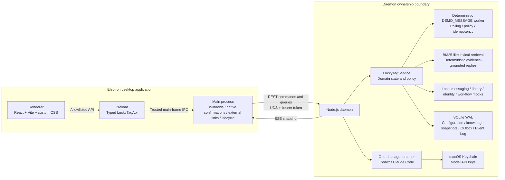

# LuckyTag v0.3 Architecture and Trust Boundaries

This document describes the **current implementation**, security assumptions, and evolution boundaries of LuckyTag v0.3. If the target architecture diagram or product description differs from the source code, the as-built behavior documented here and implemented in the referenced code takes precedence.

## How to Read the Target Architecture


The diagram captures the long-term boundaries LuckyTag intends to preserve: the UI can exit while the local service continues running, external runtime processes remain isolated from the main application, and local state can recover transactionally. It is not an as-built diagram of every v0.3 capability.

| Diagram component | Actual v0.3 status |
| --- | --- |
| React + Vite | Implemented. The UI uses custom CSS, not Ant Design or Tailwind CSS. |
| Electron security boundary | Implemented with `contextIsolation`, Node.js integration disabled, renderer sandboxing, and a narrow IPC surface. |
| Bun / Node backend | Only the Node.js daemon is implemented; there is no Bun runtime. |
| Unix domain socket / named pipe | Only a macOS Unix domain socket is implemented; there is no Windows named pipe or TCP fallback. |
| REST + SSE / WebSocket | REST and SSE are implemented; WebSocket is not. |
| Agent / Session and Workflow / Scheduler | Limited to DEMO_MESSAGE polling and one-shot runtime configuration tests. There is no general-purpose Agent, Session, or Workflow engine. |
| Skills / MCP / Plugins | Not implemented. Model connectivity tests explicitly disable tools, MCP, hooks, and session persistence. |
| Isolated executors | Each connectivity test receives a dedicated working directory and subprocess cleanup. This is not an OS container, virtual machine, or persistent worker pool. |
| SQLite WAL and Event Log / Outbox | Implemented. |
| Vector index | Not implemented. The current system restores knowledge snapshots from SQLite and builds an in-memory BM25-like lexical index. |
| Config / Credentials (Keychain) | Non-secret configuration is stored in SQLite. Only model API keys are persisted in macOS Keychain. |
| Web / Mobile / Cloud entry points | Not implemented. |

## Current v0.3 Architecture



Some domain code still resides under `src/main/core/`, but in v0.3 the daemon constructs and executes those services. Electron Main no longer owns worker timers.

## Process Responsibilities

| Boundary | Current responsibilities | Explicitly out of scope |
| --- | --- | --- |
| Renderer | Render snapshots, collect form input, and initiate user actions. | Direct filesystem access, subprocesses, Keychain access, or direct network access. |
| Preload | Map the limited `LuckyTagApi` surface to IPC calls. | Exposing general Node.js or Electron capabilities. |
| Electron Main | Manage windows, validate trusted origins, present the system directory picker and native confirmations, open Finder or external links, and coordinate the daemon lifecycle. | Business workers, long-running scheduling, or database ownership. |
| Node.js daemon | Own the API, SSE snapshots, domain services, scheduling, connectors, SQLite, and runtime launches. | UI rendering or a cloud control plane. |
| Runtime subprocess | Perform one constrained model connectivity test. | Automatic-reply decisions, persistent agent sessions, or arbitrary tool execution. |

## Electron Security Boundary

### Renderer and Preload

- `nodeIntegration: false`
- `contextIsolation: true`
- `sandbox: true`
- `webSecurity: true`
- Preload exposes only the `LuckyTagApi` methods defined by the shared contracts.

Production builds load packaged static assets through `app://luckytag` instead of granting privileges to a `file://` page. Protocol resolution rejects path traversal and unexpected resources. The production Content Security Policy sets `connect-src` to `'none'`, so the renderer cannot connect directly to the daemon or a remote provider.

### Main Process

Every IPC request must satisfy all of the following conditions:

1. The request originates from the current main window's `webContents`.
2. The requesting frame is the main frame.
3. The page origin matches either the trusted development URL or the exact production entry point.
4. The input passes the shared validators.
5. Any local knowledge directory was authorized through the system directory picker.
6. Enabling demo sends and resetting SampleAuth require a native macOS confirmation.

Electron Main blocks new windows and page navigation and denies session permission requests from the renderer. A DemoWorkflow result URL is handed to the system browser only after its HTTPS hostname and parameters pass validation.

## Daemon Lifecycle and Local Transport

### Transport and Authentication

- The daemon entry point is `src/daemon/index.ts`; its build output is `out/main/daemon.js`.
- On macOS, the daemon listens only on a Unix domain socket and exposes no TCP port. The socket mode is `0600`.
- The first run creates a random 256-bit installation token in a file with mode `0600`.
- REST and SSE both require the bearer token, which the server verifies with a timing-safe comparison.
- The health handshake compares both the protocol version and the daemon bundle's SHA-256 digest, preventing an updated Electron client from silently reusing an incompatible older daemon.
- SSE emits a heartbeat every 15 seconds. The client reconnects when the stream becomes inactive and discards stale snapshots using a monotonic revision.

The UDS permissions and installation token form a **capability boundary within the same Mac and logged-in user session**. They reduce cross-user access and accidental connections, but they do not defend against a compromised current user account or `root`.

### Continued Operation

The packaged application installs `~/Library/LaunchAgents/com.luckytag.daemon.plist` for the current user with the following properties:

- `RunAtLoad: true`
- `KeepAlive.SuccessfulExit: false`
- `ProcessType: Background`
- launchd throttles restarts after failures.

The precise guarantee is therefore: **the daemon is designed to continue running independently of the Electron UI while the current user remains logged in to macOS**. It is not a system-level service, does not survive logout, and is not an unconditional 24/7 service.

If a managed environment explicitly rejects LaunchAgent installation with `EACCES` or `EPERM`, LuckyTag falls back to a detached sidecar and writes a marker with mode `0600`. A later desktop launch attempts to restore launchd management. The fallback can outlive the Electron UI, but it provides neither restart-on-crash nor login-time startup. Signature, path, format, and timeout errors do not trigger a silent fallback.

The daemon uses a single-instance lock and probes the active socket before replacing anything, removing only stale sockets that cannot be reached. During shutdown, it terminates agent subprocesses, preserves the worker's configured intent to run, closes the database, and removes the socket. After an unexpected restart, polling resumes only if the configuration still satisfies every safety gate.

## Deterministic Automatic-Reply Pipeline

The current scheduler is not a general-purpose workflow engine. It is a deterministic polling worker built specifically for DEMO_MESSAGE group chats.

```mermaid
sequenceDiagram
  participant W as DEMO_MESSAGE Worker
  participant D as DEMO_MESSAGE CLI
  participant R as Lexical Retrieval
  participant O as SQLite Outbox

  W->>W: Validate switches, allowlist, knowledge snapshot, and rate limits
  W->>D: Read new messages from allowlisted chats
  D-->>W: Messages and immutable conversation IDs
  W->>W: Deduplicate; apply initial-watermark, sender, retraction, and human-takeover checks
  W->>R: Retrieve evidence for the question
  R-->>W: Ranked excerpts and scores
  W->>O: Persist the candidate reply and state
  W->>D: Re-read the source message and latest history before sending
  alt Dry run or any safety gate fails
    W->>O: Record preview / ignored / needs_manual
  else Live-send authorization is present
    W->>D: Send with a stable UUID
    W->>O: Record sent or indeterminate state
  end
```

The key safety rules are:

- Chat authorization uses an exact, immutable `channelId`. The DEMO_MESSAGE adapter repeats the same allowlist check.
- The first enabled scan establishes a watermark and never replies to historical messages.
- The worker processes only new text messages that explicitly mention the current user. Messages sent by that user, retracted messages, duplicates, and messages with an existing human reply are excluded.
- If the evidence score does not reach the configured threshold, processing stops. LuckyTag does not ask a model to fill gaps or guess an answer.
- A candidate reply is composed deterministically from no more than three knowledge excerpts and retains source citations.
- Immediately before sending, the worker rechecks the source message, latest chat history, active knowledge index, policy, and allowlist to reduce time-of-check/time-of-use risk.
- Dry-run is the default. A live send requires both the master configuration switch and a native approval assertion from Electron Main.
- A stable UUID, a two-minute lease, and bounded retries reduce duplicate delivery. DEMO_MESSAGE provides a 24-hour idempotency window; a result that remains indeterminate is escalated for manual handling.

These controls reduce duplicate risk under at-least-once external-call semantics. They do not promise strict exactly-once delivery across systems.

## Knowledge Synchronization and Retrieval

### Sources

- Local directories containing Markdown, MDX, TXT, HTML, or HTM files.
- Individual SampleLibrary documents or knowledge bases read through the `sampleLibrary` CLI in the current user's environment.

The local scanner skips symbolic links, hidden directories, and common build directories. Each file is limited to 5 MiB, and each source is limited to 2,000 files. SampleLibrary synchronization swaps complete snapshots atomically. If a source is temporarily unavailable, LuckyTag retains the most recent successful snapshot and reports the error in the UI.

### Index

- Documents are split into chunks of approximately 900 characters with an overlap of 120 characters.
- Chinese text is tokenized into character bigrams; English text uses normalized terms.
- After restoring a knowledge snapshot from SQLite, the daemon builds a BM25-like lexical index in memory.
- Retrieval returns the five highest-ranked matches, and a reply cites no more than three excerpts.

The current implementation has no embeddings, approximate-nearest-neighbor index, external vector database, semantic reranker, or fine-grained chat-to-knowledge-source ACL. Before vector retrieval can be introduced, the design must define embedding data governance, index versioning, migration, deletion semantics, and authorization mapping.

## Local Data Model

A single SQLite database resides at `runtime/luckytag.sqlite3` under the application data directory. Each connection enables:

- WAL journal mode
- `foreign_keys = ON`
- `busy_timeout = 5000`
- `synchronous = FULL`

| Store | Contents | Guarantees and limitations |
| --- | --- | --- |
| `json_documents` | AppConfig v3, knowledge snapshots, and worker metadata. | Revision-controlled updates; business-state and Outbox changes can commit in the same transaction. |
| `outbox` | Complete reply records, states, leases, stable UUIDs, citations, and bodies. | Incomplete records are never evicted. Terminal reply bodies retain the most recent 5,000 records, while send records from the most recent hour are also retained. |
| `event_log` | State transitions and storage-event summaries. | SQLite triggers reject `UPDATE` and `DELETE`. This is not a cryptographically signed or tamper-proof audit log. |
| `legacy_imports` | SHA-256 digests and import records for legacy JSON files. | Prevents the same legacy data from being migrated more than once; source files are not deleted. |

SQLite and the Outbox provide transactional consistency and support continued processing after a crash. They are not a backup system, off-site disaster recovery, or encrypted storage. Knowledge mirrors, reply bodies, and audit summaries have no application-layer encryption at rest by default; protecting the device depends on FileVault, controlled user accounts, and operating-system permissions.

## Agent Runtime and Model Configuration

### Current Scope

The Application Configuration page supports:

- discovery of the `codex` and `claude-code` runtimes;
- either the runtime's existing authentication or a custom model name, provider endpoint, authentication method, and API key;
- OpenAI Responses for Codex;
- Anthropic Messages for Claude Code; and
- a model connectivity test that uses one fixed, minimal prompt.

This is not a general-purpose agent orchestration layer. There are no persistent agent sessions, tool execution, workflow DAGs, MCP servers, or plugin lifecycle. The automatic-reply worker does not consume agent output.

### Credential Boundary

1. Non-secret configuration is persisted in SQLite. The persistent copy of a model API key exists only in macOS Keychain.
2. Keychain entries are isolated by a digest of `runtime + normalized provider endpoint`. Changing the runtime or endpoint requires the key to be configured again.
3. When a user enters an API key in the renderer and saves it, the plaintext briefly exists in request memory across Renderer, Preload, Main, and the daemon. The daemon passes it to Keychain through standard input. The key never appears in process arguments, SQLite, application logs, or subsequent snapshots.
4. After the save completes, the renderer can see only `apiKeyConfigured: boolean` in snapshots and cannot read the plaintext back from the daemon.
5. Remote provider endpoints must use HTTPS. HTTP and unauthenticated modes are allowed only for `localhost`, `127.0.0.1`, or `::1`.
6. Public connector mocks contain no credentials, invoke no external CLIs, and store no connector secrets in LuckyTag Keychain entries.

### Runtime Trust and Process Isolation

- Codex BYOK credentials are released only to the Codex CLI bundled with ChatGPT after its canonical path, owner, permissions, and SHA-256 digest pass validation.
- Custom-model credentials for Claude Code are released only to the official pinned npm distribution after its package name, version, owner, permissions, package metadata, and entry-point SHA-256 digest pass validation.
- A same-named executable found on `PATH`, an ambiguous entry point, or a modified trusted file fails closed and cannot obtain the API key.
- Each connectivity test creates a dedicated working directory with mode `0700` and uses `shell: false`, a constrained environment, bounded stdout and stderr, a timeout, and process-group cleanup.
- Connectivity tests use a fixed prompt and disable tools, MCP, hooks, project settings, and session persistence. The test endpoint also applies single-flight execution and a cooldown to prevent repeated triggering.

These controls reduce risks from misconfiguration, path hijacking, unbounded output, and orphaned processes, but they do not constitute an OS-level sandbox. A trusted runtime still receives the API key injected into it and can access the network according to its own implementation. Current connectivity tests must not process untrusted files or sensitive chat content.

## Connector and Identity Boundaries

| Connector | Current capability | Credential owner | Limitations |
| --- | --- | --- | --- |
| DEMO_MESSAGE | Probe login state; search chats; read history; poll and send messages. | `demoMessage` CLI | Uses a personally authorized CLI session, not an event webhook. |
| SampleLibrary | Probe identity and mirror individual documents or knowledge bases. | `sampleLibrary` CLI | Retains the last successful snapshot after synchronization failures. |
| SampleAuth | Demonstrate local identity state and reset actions. | Built-in mock | Does not grant messaging or library access; reset requires native confirmation. |
| DemoWorkflow | Read chat history, preview a draft, create after confirmation, and open the result. | `demoWorkflow` CLI | Requires user confirmation before writing; result URLs are restricted. |
| SampleDevice | Contract and UI placeholder only. | Not enabled | Fails closed in v0.3 and does not access hardware. |

Connector binaries, remote sessions, and server-side permissions are not part of LuckyTag 2.0. Public mocks stay local and must never present a simulated connection as access to an external system.

## Threat Model

### Risks v0.3 Is Designed to Reduce

- A malicious or navigated renderer directly accessing Node.js, the filesystem, the daemon, or remote networks.
- Another local user accidentally connecting to the LuckyTag socket or reading its token or working directories.
- `PATH` hijacking that gives an untrusted same-named runtime access to a model API key.
- API keys being persisted in SQLite, logs, process arguments, or UI snapshots.
- An outdated daemon, duplicate or historical messages, message retraction, human takeover, or policy changes causing an unintended send.
- A crash during the prepare-send-confirm window amplifying duplicate delivery when recovery has no durable state.

### Risks Explicitly Out of Scope

- `root`, a compromised current macOS user session, or malware capable of reading that user's memory or Keychain.
- A trusted runtime or upstream CLI that contains a vulnerability or behaves maliciously after passing local validation.
- Server-side security and data handling by any future connector or explicitly configured model provider.
- Offline disk access when FileVault is disabled, or a user deliberately exporting or uploading the local database.
- OS-container isolation, network microsegmentation, hardware-backed key confinement, or cryptographically tamper-evident logs.
- Strict exactly-once delivery across external systems, complete backups, or disaster recovery.

## Packaging and Distribution Boundary

`pnpm package:mac` currently builds an Apple Silicon application directory and performs the following local verification:

- Packages application code in ASAR and enables the `EnableEmbeddedAsarIntegrityValidation` and `OnlyLoadAppFromAsar` Electron Fuses.
- Disables Electron `RunAsNode`, `NODE_OPTIONS`, and debugging CLI argument entry points.
- Tightens App Transport Security without arbitrary-load or localhost exceptions.
- Embeds a standalone Node.js sidecar and its LICENSE and NOTICE files.
- Verifies the sidecar's signature and executability.
- Launches the packaged daemon to verify protocol identity, UDS authentication, `0600` socket and token permissions, and graceful shutdown.

The current artifact uses ad hoc signing and is intended only for local development validation. There is no DMG, Developer ID signing, notarization, automatic update mechanism, or production release-signing chain. Before distributing binary artifacts publicly, the project must add supply-chain controls, signing, notarization, upgrade and rollback handling, and a vulnerability-response process.

## Current Implementation and Roadmap

### Implemented

- Secure separation between Electron Renderer, Preload, and Main.
- Node.js daemon, macOS UDS, REST/SSE, installation token, and protocol/build-identity handshake.
- User-level LaunchAgent with an explicit detached fallback for narrowly defined permission failures.
- SQLite WAL, Outbox, an append-only event table, and one-time legacy JSON migration.
- Local and SampleLibrary knowledge mirrors, BM25-like lexical retrieval, and deterministic evidence-grounded replies.
- DEMO_MESSAGE allowlisted polling, dry-run, human-takeover and message-retraction checks, rate limiting, idempotency, and auditing.
- SampleAuth and DemoWorkflow mocks, plus configuration and connectivity-test boundaries for Codex and Claude Code.

### Designed or Not Yet Implemented

- A standalone vector database, embedding pipeline, semantic retrieval, and knowledge ACLs.
- Persistent Agent/Session state, a general-purpose Workflow/Scheduler, and an approval-policy engine.
- Skills, MCP, and plugin discovery, installation, and permission models.
- A persistent isolated worker pool and an actual OS-level least-privilege sandbox.
- A web administration console, mobile or IM extensions, cloud accounts, and a remote control plane.
- SampleDevice hardware integration.
- Developer ID signing, notarization, automatic updates, and a production release channel.

## Code Map

```text
src/daemon/index.ts             Daemon HTTP/UDS API, SSE, authentication, and lifecycle
src/daemon/agent-runtime.ts     Runtime discovery, process isolation, and constrained command execution
src/main/index.ts               Electron Main, trusted IPC, and native system actions
src/main/daemon-manager.ts      LaunchAgent installation, upgrades, and fallback
src/main/daemon-client.ts       UDS REST/SSE client and snapshot subscription
src/main/core/service.ts        Domain-service composition and configuration/snapshot ownership
src/main/core/worker.ts         Deterministic DEMO_MESSAGE automatic-reply state machine
src/main/core/retrieval.ts      Lexical tokenization, indexing, and ranking
src/main/core/sqlite-storage.ts SQLite, Outbox, Event Log, and migration
src/preload/index.ts            Minimal LuckyTagApi bridge
src/renderer/src/               React UI and project styles
src/shared/                     Cross-process contracts and input validation
scripts/after-pack.cjs          Electron Fuses, ATS, and sidecar packaging
scripts/verify-packaged-daemon.cjs Package-level security verification
```
