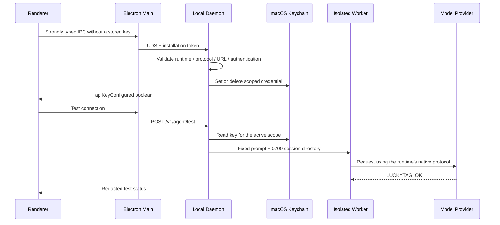

# LuckyTag BYOK Provider Integration Design

**Status:** Implemented in 0.3.0; additional protocol adapters remain on the roadmap

**Target version:** 0.3.0

**Applicable architecture:** Electron renderer / preload / main process + UDS + standalone local daemon + one-shot isolated agent runner + SQLite / Keychain

## 1. Summary

LuckyTag offers **two BYOK (Bring Your Own Key) configuration paths** alongside one non-BYOK mode:

1. **Preconfigured provider profile:** Select a provider profile, then enter a model name and API key. LuckyTag supplies the protocol, guidance, and a default endpoint where one is generally applicable. A profile is a configuration convenience, not a compatibility guarantee; the connection test checks only basic one-shot connectivity with the selected model and endpoint.
2. **Custom compatible endpoint:** Select a protocol, then enter a model name, endpoint, and API key. This path is intended for enterprise gateways, self-hosted proxies, and local model services. The connection test checks basic one-shot connectivity but does not certify full protocol compatibility.
3. **Runtime default configuration** (not BYOK): Reuse the sign-in and model selection already managed by Codex or Claude Code. LuckyTag does not read those credentials.

The broader provider landscape includes **five model protocol families**:

| Protocol family | Typical entry point | Key distinctions | LuckyTag 0.3 |
| --- | --- | --- | --- |
| OpenAI Responses | `POST /v1/responses` | Agent tool calls, reasoning items, and multi-turn state semantics | **Supported** through Codex CLI |
| OpenAI Chat Completions | `POST /v1/chat/completions` | Broadly compatible, but does not imply support for Responses-specific agent semantics | Recognized, with no separate agent-compatibility commitment |
| Anthropic Messages | `POST /v1/messages` | `x-api-key`, `anthropic-version`, and content blocks | **Supported** through Claude Code |
| Google Gemini native | `generateContent` / Interactions | Native Google request, tool, and authentication semantics | Direct adapter planned for Phase 2 |
| AWS Bedrock Runtime | Converse / Invoke | SigV4, regions, and model ARNs/IDs | Native Converse/Invoke and SigV4 support planned for Phase 2; Phase 1 can use a compatible endpoint only |

Despite that broader landscape, the shipped product exposes exactly **two protocol enum values**: `openai-responses` and `anthropic-messages`. This is an intentional fail-closed boundary, not an omission: LuckyTag exposes only protocols that the current runtimes can execute and that the end-to-end suite verifies. Native Bedrock Runtime with SigV4 is not shipped in 0.3.

## 2. Upstream Capability Review

- OpenAI recommends the Responses API for agents, reasoning, and tool use. Some models also expose Chat Completions, while Codex-specific models may support Responses only. See the [OpenAI latest model guide](https://developers.openai.com/api/docs/guides/latest-model) and [GPT-5 Codex model reference](https://developers.openai.com/api/docs/models/gpt-5-codex).
- Anthropic's native interface is the Messages API. Requests use `/v1/messages`, `x-api-key`, and the required `anthropic-version` header. See [Anthropic authentication](https://platform.claude.com/docs/en/api/authentication) and [Anthropic versioning](https://platform.claude.com/docs/en/api/versioning).
- Gemini provides a native API as well as a compatibility layer for OpenAI client libraries. Google labels the compatibility layer as beta and recommends the native Gemini API for new projects. See the [Gemini API reference](https://ai.google.dev/api) and [OpenAI compatibility guide](https://ai.google.dev/gemini-api/docs/openai).
- Azure OpenAI exposes Responses at `{endpoint}/openai/v1/responses` and supports an `api-key`, a bearer token, or Microsoft Entra ID. The underlying protocol remains OpenAI Responses; the primary differences are endpoint construction and authentication. See [Azure OpenAI Responses](https://learn.microsoft.com/en-us/rest/api/microsoft-foundry/azureopenai/responses).
- Amazon Bedrock provides native Runtime/Converse APIs as well as OpenAI- and Anthropic-compatible entry points. Native calls normally use SigV4; compatibility endpoints can reduce SDK migration effort but do not make native Bedrock support part of LuckyTag 0.3. See [Bedrock APIs](https://docs.aws.amazon.com/bedrock/latest/userguide/apis.html) and [Bedrock endpoints](https://docs.aws.amazon.com/bedrock/latest/userguide/endpoints.html).
- Ollama exposes OpenAI-compatible Responses and Chat Completions from a local service. Its Responses implementation currently does not provide server-side conversation state. See [Ollama OpenAI compatibility](https://docs.ollama.com/api/openai-compatibility).
- OpenRouter exposes a stateless, OpenAI-compatible Responses API in beta and authenticates with a bearer token. See [OpenRouter Responses](https://openrouter.ai/docs/api/reference/responses/overview).

### 2.1 Preconfigured Provider Profiles

| Preconfigured provider profile | Protocol | Runtime | Endpoint policy | Authentication |
| --- | --- | --- | --- | --- |
| OpenAI | OpenAI Responses | Codex | `https://api.openai.com/v1` | API key |
| Example Cloud | OpenAI Responses-compatible | Codex | `https://api.example.invalid/v1` | API key |
| OpenRouter | OpenAI Responses-compatible | Codex | `https://openrouter.ai/api/v1` | API key |
| Azure OpenAI | OpenAI Responses-compatible | Codex | User-specific resource endpoint | API key; OAuth is planned |
| Amazon Bedrock-compatible endpoint | OpenAI Responses / Anthropic Messages | Runtime matching the selected protocol | User-specific regional compatibility endpoint | API key for the compatible gateway; native SigV4 is planned |
| Ollama | OpenAI Responses-compatible | Codex | `http://127.0.0.1:11434/v1` | No authentication on loopback |
| Anthropic | Anthropic Messages | Claude Code | `https://api.anthropic.com` | API key |
| Custom compatible service | User-selected shipped protocol | Runtime matching the selected protocol | HTTPS, or loopback HTTP | API key, or no authentication on loopback |

A preconfigured provider profile does not certify protocol compatibility. A successful connection test establishes only basic one-shot connectivity with the selected model and endpoint. Matching a URL shape or field name alone does not establish equivalent tool-call behavior, streaming events, reasoning semantics, or error handling.

## 3. Product Design

### 3.1 Information Architecture

**Application Configuration → Agent Model Configuration** has three levels:

1. Runtime: Codex CLI or Claude Code.
2. Configuration mode: runtime default, preconfigured provider profile, or custom endpoint.
3. Connection parameters: protocol, provider, model, endpoint, authentication method, and API key.

Interaction rules:

- Selecting Codex exposes only OpenAI Responses; selecting Claude Code exposes only Anthropic Messages.
- A preconfigured provider profile supplies the protocol and, where available, a default endpoint, while the model name remains editable.
- `none` authentication is allowed only for `localhost`, `127.0.0.1`, or `::1`. Remote endpoints require an API key.
- After a key is saved, it is immediately cleared from renderer state. The UI reports only that a key has been stored securely.
- Changing the runtime, endpoint, or authentication method must never send an existing key silently to the new target.
- A successful save does not establish compatibility. The UI shows a recent successful state only after the connection test passes.

### 3.2 Configuration Model v3

```ts
type AgentModelProtocol = 'openai-responses' | 'anthropic-messages'
type AgentProviderId =
  | 'openai' | 'anthropic' | 'sample-cloud' | 'openrouter'
  | 'azure-openai' | 'aws-bedrock' | 'ollama' | 'custom'
type AgentAuthenticationKind = 'api-key' | 'none'

interface AgentModelConfiguration {
  provider: AgentProviderId
  protocol: AgentModelProtocol
  authentication: AgentAuthenticationKind
  name: string
  baseUrl: string
  apiKeyConfigured: boolean
}
```

During migration from v2 to v3, LuckyTag derives the protocol from the runtime: Codex maps to `openai-responses`, and Claude Code maps to `anthropic-messages`. An existing Example Cloud URL maps to `sample-cloud`; official provider URLs map to `openai` or `anthropic`; all other URLs map to `custom`. Existing Keychain scopes remain readable so an upgrade does not force users to enter their keys again without cause.

### 3.3 Request Path



### 3.4 Security Boundaries

- Persisted real API keys are stored only in Keychain. While being saved, plaintext briefly traverses the trusted IPC/UDS request path; it never enters SQLite, logs, `argv`, or page snapshots. Automated fixtures use only explicit fake keys.
- LuckyTag passes a Codex BYOK key only to the current bundled Codex entry point after its path, owner, permissions, and SHA-256 digest all match the trusted baseline. An executable of the same name on `PATH`, or a digest mismatch after an upgrade, causes the operation to fail closed.
- The Keychain scope remains `runtime + normalized endpoint`. Configuration validation constrains protocol and authentication combinations, and changing the endpoint requires the key to be entered again.
- A custom remote endpoint must use HTTPS. HTTP is allowed only for loopback addresses.
- `none` authentication is allowed only on loopback. The runner uses a local placeholder token with no secret value when an SDK or CLI requires a non-empty key.
- Configuration saves and tests remain single-flight operations with cooldown enforcement in the daemon. Renderer validation improves usability; daemon validation is the trust boundary.
- In Phase 1, agents are used only for configuration tests and never enter the SampleMessaging knowledge-grounded reply pipeline automatically.

## 4. Implementation Scope

### Phase 1: Implemented in 0.3.0

- Backward-compatible migration from AppConfig v1/v2 to v3.
- Provider, protocol, and authentication contracts with strict validation and canonicalization.
- Preconfigured provider profiles, custom endpoints, and a no-authentication UI for local Ollama.
- Codex `wire_api = "responses"` and Claude Messages runtime constraints.
- Keychain isolation, mandatory key re-entry after changing targets, connection testing, and redacted status.
- Unit tests, daemon security tests, runner tests, renderer SSR tests, end-to-end tests that run trusted CLIs against local stub providers, and the full regression suite.

### Phase 2: Roadmap

- Native Gemini adapter.
- Native Bedrock Converse / Invoke integration with a SigV4 credential provider.
- Azure Entra ID / workload identity.
- Provider model discovery, capability probing, and consistent streaming-event tests.
- OS-level network and filesystem isolation before agents are connected to a general-purpose session or workflow engine.

## 5. Acceptance Criteria

1. After upgrading from v2, existing runtime, endpoint, model, and key settings continue to work.
2. The daemon rejects any runtime/protocol mismatch.
3. A missing key for a remote endpoint, remote HTTP, URL `userinfo` components, URL fragments, and control characters are all rejected.
4. Local Ollama can use no authentication without creating or reading a Keychain item.
5. Changing endpoints never sends the old key to the new endpoint.
6. A configuration test sends only a fixed minimal request, does not read the operational knowledge base, and never exposes the key.
7. The full test suite, explicit BYOK end-to-end test, production build, and macOS package verifier all pass.
