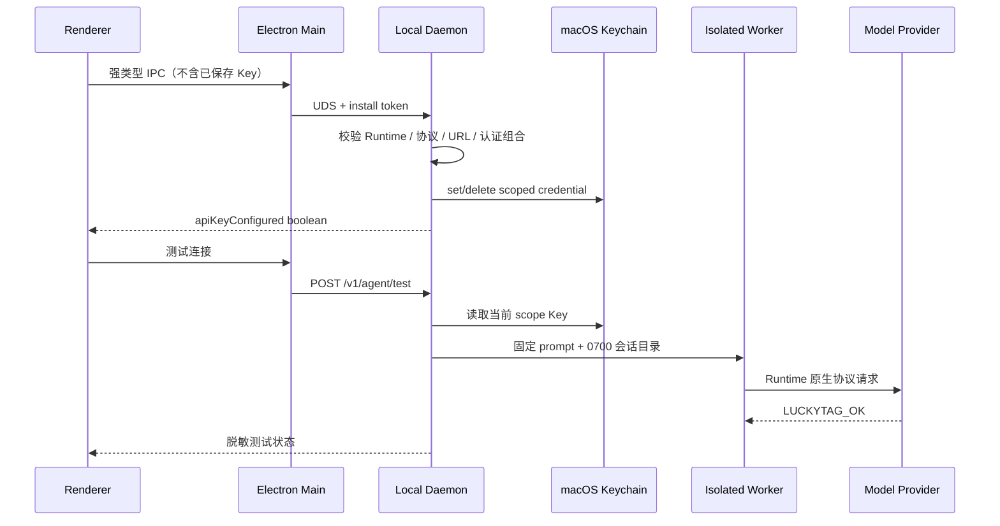

# LuckyTag BYOK 模型接入方案

状态：已在 0.3.0 实现；后续协议适配见路线图

目标版本：0.3.0

适用架构：Electron Renderer / Preload / Main + UDS + 独立本机 Daemon + 隔离 Agent Worker + SQLite / Keychain

## 1. 结论

BYOK（Bring Your Own Key）在 LuckyTag 中有 **2 种用户配置方式**，并与 1 种非 BYOK 模式并存：

1. **Provider 预设 BYOK**：选择已验证的服务商，填写模型和 Key；协议、默认 Endpoint 与说明由 LuckyTag 提供。
2. **自定义兼容 Endpoint BYOK**：选择协议，填写模型、Endpoint 和 Key；适合企业网关、自建代理与本机模型服务。
3. **沿用 Runtime 默认配置**（非 BYOK）：复用 Codex / Claude Code 自己的登录与模型选择，LuckyTag 不读取凭据。

行业侧需要识别 **5 类模型协议**：

| 协议族 | 典型入口 | 主要差异 | LuckyTag 0.3 |
| --- | --- | --- | --- |
| OpenAI Responses | `POST /v1/responses` | Agent 工具调用、推理项和多轮状态语义 | **支持**，由 Codex CLI 执行 |
| OpenAI Chat Completions | `POST /v1/chat/completions` | 广泛兼容，但不能假定具备 Responses 的 Agent 语义 | 识别，不单独承诺 Agent 兼容 |
| Anthropic Messages | `POST /v1/messages` | `x-api-key`、`anthropic-version`、Content Blocks | **支持**，由 Claude Code 执行 |
| Google Gemini Native | `generateContent` / Interactions | Google 原生请求、工具与认证语义 | 二期直连 Adapter |
| AWS Bedrock Runtime | Converse / Invoke | SigV4、区域与模型 ARN/ID | 二期直连 Adapter；一期可用兼容入口 |

因此，一期产品协议枚举只有 **2 个**：`openai-responses` 与 `anthropic-messages`。这不是遗漏，而是 fail-closed：仅展示能被当前 Runtime 真正执行并被端到端测试验证的协议。

## 2. 官方能力调研

- OpenAI 对 Agent、推理和工具调用推荐 Responses API；部分模型同时暴露 Chat Completions，但 Codex 专用模型可只支持 Responses。[OpenAI latest model guide](https://developers.openai.com/api/docs/guides/latest-model)、[GPT-5 Codex model](https://developers.openai.com/api/docs/models/gpt-5-codex)
- Anthropic 原生入口是 Messages API，请求使用 `/v1/messages`、`x-api-key` 与必填的 `anthropic-version`。[Anthropic authentication](https://platform.claude.com/docs/en/api/authentication)、[Anthropic versioning](https://platform.claude.com/docs/en/api/versioning)
- Gemini 有原生 API，也提供 OpenAI libraries 兼容层；官方将兼容层标注为 beta，并建议新项目优先使用原生 Gemini API。[Gemini API reference](https://ai.google.dev/api)、[OpenAI compatibility](https://ai.google.dev/gemini-api/docs/openai)
- Azure OpenAI 的 Responses 路径是 `{endpoint}/openai/v1/responses`，可用 `api-key`、Bearer Key 或 Microsoft Entra ID；协议主体仍属于 OpenAI Responses，差异主要在 Endpoint 和认证。[Azure OpenAI Responses](https://learn.microsoft.com/en-us/rest/api/microsoft-foundry/azureopenai/responses)
- Amazon Bedrock 同时有 AWS 原生 Runtime/Converse 与 OpenAI/Anthropic 兼容入口；原生入口通常使用 SigV4，兼容入口可降低 SDK 迁移成本。[Bedrock APIs](https://docs.aws.amazon.com/bedrock/latest/userguide/apis.html)、[Bedrock endpoints](https://docs.aws.amazon.com/bedrock/latest/userguide/endpoints.html)
- Ollama 本机服务提供 OpenAI-compatible Responses 与 Chat Completions；Responses 当前不提供服务端会话状态。[Ollama OpenAI compatibility](https://docs.ollama.com/api/openai-compatibility)
- OpenRouter 提供 OpenAI-compatible Responses beta，当前为 stateless，并以 Bearer Key 认证。[OpenRouter Responses](https://openrouter.ai/docs/api/reference/responses/overview)

### 2.1 供应商覆盖矩阵

| Provider 预设 | 协议 | Runtime | Endpoint 策略 | 认证 |
| --- | --- | --- | --- | --- |
| OpenAI | OpenAI Responses | Codex | `https://api.openai.com/v1` | API Key |
| 蚂蚁数科 MaaS | OpenAI Responses-compatible | Codex | `https://maas-api.antdigital.com/v1` | API Key |
| OpenRouter | OpenAI Responses-compatible | Codex | `https://openrouter.ai/api/v1` | API Key |
| Azure OpenAI | OpenAI Responses-compatible | Codex | 用户资源 Endpoint | API Key；OAuth 后续支持 |
| Amazon Bedrock compatible endpoint | OpenAI Responses / Anthropic Messages | 对应 Runtime | 用户区域 Endpoint | Bearer Key；SigV4 后续支持 |
| Ollama | OpenAI Responses-compatible | Codex | `http://127.0.0.1:11434/v1` | 本机无认证 |
| Anthropic | Anthropic Messages | Claude Code | `https://api.anthropic.com` | API Key |
| 自定义兼容服务 | 由用户选择 | 对应 Runtime | HTTPS 或本机回环 HTTP | API Key / 本机无认证 |

“兼容”必须由配置测试确认。仅实现相同 URL 或字段名称，不代表工具调用、流式事件、推理项和错误语义完全兼容。

## 3. 产品设计

### 3.1 信息架构

`应用配置 → Agent 模型配置` 分成三层：

1. Runtime：Codex CLI / Claude Code。
2. 配置方式：沿用 Runtime / Provider 预设 / 自定义 Endpoint。
3. 连接参数：协议、Provider、模型、Endpoint、认证方式、Key。

交互原则：

- 选择 Codex 时只展示 OpenAI Responses；选择 Claude Code 时只展示 Anthropic Messages。
- Provider 卡片负责填入协议和默认 Endpoint，但模型名始终允许用户填写。
- `无认证` 只允许 `localhost`、`127.0.0.1` 或 `::1`，远程地址强制 API Key。
- Key 保存后立即从 Renderer state 清空，页面只显示“已安全保存”。
- Runtime、Endpoint 或认证方式变化时，旧 Key 不得被静默发送到新目标。
- 保存成功不等于可用；必须通过“测试连接”才展示最近测试成功状态。

### 3.2 配置模型 v3

```ts
type AgentModelProtocol = 'openai-responses' | 'anthropic-messages'
type AgentProviderId =
  | 'openai' | 'anthropic' | 'ant-digital-maas' | 'openrouter'
  | 'azure-openai' | 'aws-bedrock' | 'ollama' | 'custom'
type AgentAuthenticationKind = 'api-key' | 'none'

interface AgentModelConfiguration {
  provider: AgentProviderId
  protocol: AgentModelProtocol
  authentication: AgentAuthenticationKind
  name: string
  baseUrl: string
  apiKeyConfigured: boolean
}
```

配置从 v2 迁移到 v3 时按 Runtime 推导协议：Codex → `openai-responses`，Claude Code → `anthropic-messages`；已有蚂蚁数科 URL 推导为 `ant-digital-maas`，官方 URL 推导为 `openai` / `anthropic`，其余推导为 `custom`。已有 Keychain scope 保持可读，避免升级后要求用户无故重新录入。

### 3.3 调用链



### 3.4 安全边界

- Key 只写入 Keychain，不进入 SQLite、日志、argv、页面快照或测试 fixture。
- Codex BYOK Key 只交给路径、owner、权限和 SHA-256 均匹配的当前内置 Codex；同名 PATH 程序或升级后摘要不匹配都会 fail closed。
- Keychain scope 保持 `runtime + normalized endpoint`；协议与认证组合由配置校验约束，Endpoint 改变必须重新输入 Key。
- 自定义远程 Endpoint 必须 HTTPS；HTTP 只允许回环地址。
- `none` 认证仅允许回环地址，Runner 使用不具备秘密价值的本机占位 token 适配要求非空 Key 的 SDK/CLI。
- 配置保存与测试继续在 Daemon 侧 single-flight / cooldown；Renderer 校验只用于体验，Daemon 校验才是信任边界。
- 一期仍只把 Agent 用于配置测试，不自动进入钉钉知识库回复链路。

## 4. 实施范围

### 一期（本次实现）

- AppConfig v3 与 v1/v2 无损迁移。
- Provider / protocol / authentication 契约、严格校验与 canonicalization。
- 预设选择、自定义 Endpoint、本机 Ollama 无认证 UI。
- Codex `wire_api = "responses"` 与 Claude Messages 运行时约束。
- Keychain 隔离、切换目标重输、测试连接与脱敏状态。
- 单元、Daemon 安全、Runner、Renderer SSR、真实本机假 Provider E2E 与全量回归。

### 二期

- Gemini Native Adapter。
- Bedrock Converse / Invoke + SigV4 credential provider。
- Azure Entra ID / workload identity。
- Provider 模型列表发现、能力探测与流式事件一致性测试。
- Agent 正式接入 Session / Workflow 前的 OS 级网络与文件隔离。

## 5. 验收标准

1. v2 用户升级后原 Runtime、Endpoint、模型与 Key 可继续使用。
2. Runtime 与协议不匹配时 Daemon 拒绝保存。
3. 远程无 Key、远程 HTTP、userinfo、fragment、控制字符全部拒绝。
4. 本机 Ollama 可选择无认证，且不会创建或读取 Keychain 条目。
5. Endpoint 切换不会把旧 Key 发送给新 Endpoint。
6. 配置测试只发固定最小请求，不读取业务知识库，不输出 Key。
7. 全量测试、显式 BYOK E2E、production build、macOS package verifier 全绿。
